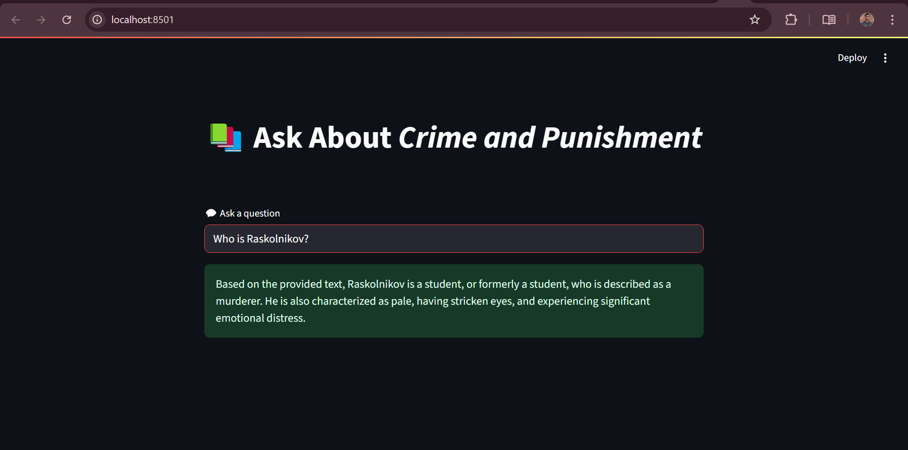
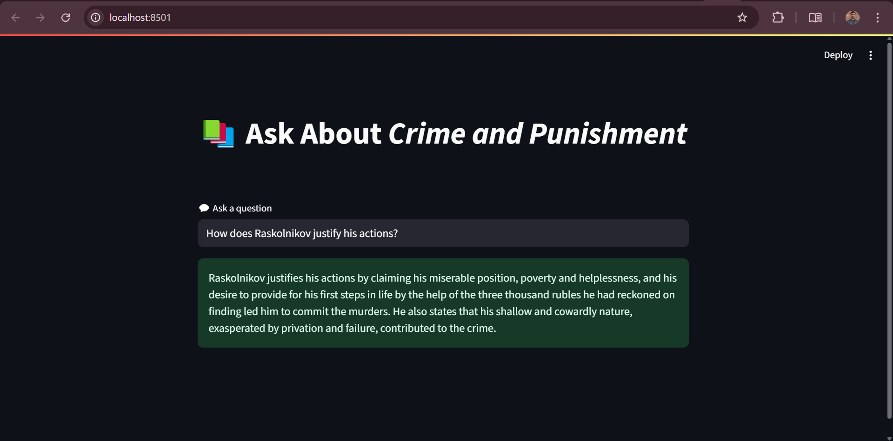

# 📚 QA-System-with-RAG

A **Question Answering System** powered by **Retrieval-Augmented Generation (RAG)** using **Gemini 1.5 Flash**. This application is designed to provide accurate, context-aware answers from long documents by combining local PDF parsing, semantic search (using FAISS), and Google Gemini LLM for generation.

---

## 🚀 Features

- 🔍 Retrieval-Augmented Generation using LangChain
- 🧠 Powered by Google's `gemini-1.5-flash-latest` model
- 📄 Processes long documents (e.g., PDF like *Crime and Punishment*)
- 🧾 Local PDF parsing and chunking
- 💬 Natural language Q&A from document content
- 🖥️ Clean Streamlit GUI for user interaction
- ⚡ FAISS-based vector search for fast similarity lookups
- 🔐 API key handled via `.env` file for security

---

## 🖼️ App Preview

> Sample screenshots from the Streamlit GUI.

### 🔹 Ask a Question





---

## 🧰 Tech Stack

- [Streamlit](w)
- [LangChain](w)
- [FAISS](w)
- [PyMuPDF (fitz)](w) for PDF processing
- [Google Generative AI](w) (`gemini-1.5-flash-latest`)

---

## ⚙️ Setup Instructions

### 1. Clone the repo

```bash
git clone https://github.com/your-username/QA-System-with-RAG.git
cd QA-System-with-RAG
